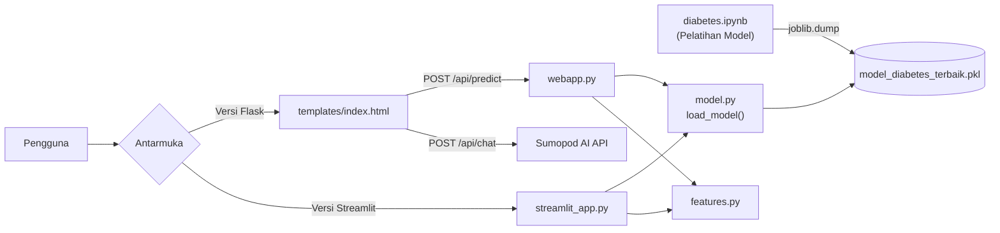

# LAMPIRAN KODE PROGRAM

**Judul Sistem:** Sistem Deteksi Dini Risiko Diabetes Mellitus Menggunakan *Machine Learning* Berbasis Indikator Kesehatan CDC

**Penyusun:** Larry Anthonio Ruitan (20922005)
**Program Studi:** Informatika
**Institusi:** Universitas Prisma Manado
**Dosen Pembimbing:** Bpk. Andreuw Lengkong & Bpk. Frendy Rumambi

---

> **Catatan:** Seluruh kode pada lampiran ini merupakan kode sumber (*source code*) aktual yang
> digunakan dalam sistem. Hasil prediksi sistem bersifat skrining edukatif dan **bukan** merupakan
> diagnosis medis definitif.

---

## Daftar Isi

- [A. Gambaran Umum Sistem](#a-gambaran-umum-sistem)
- [B. Struktur Direktori Proyek](#b-struktur-direktori-proyek)
- [C. Daftar Dependensi (`requirements.txt`)](#c-daftar-dependensi-requirementstxt)
- [Lampiran A — Pelatihan & Evaluasi Model (`diabetes.ipynb`)](#lampiran-a--pelatihan--evaluasi-model-diabetesipynb)
- [Lampiran B — Modul Konfigurasi (`config.py`)](#lampiran-b--modul-konfigurasi-configpy)
- [Lampiran C — Modul Rekayasa Fitur (`features.py`)](#lampiran-c--modul-rekayasa-fitur-featurespy)
- [Lampiran D — Modul Pemuatan Model & Prediksi (`model.py`)](#lampiran-d--modul-pemuatan-model--prediksi-modelpy)
- [Lampiran E — Backend API (`webapp.py`)](#lampiran-e--backend-api-flask-webapppy)
- [Lampiran F — Aplikasi Streamlit (`app.py` & `streamlit_app.py`)](#lampiran-f--aplikasi-streamlit)
- [Lampiran G — Antarmuka Web (`templates/index.html`)](#lampiran-g--antarmuka-web-templatesindexhtml)
- [Lampiran H — Utilitas Kompatibilitas Model (`scripts/fix_model.py`)](#lampiran-h--utilitas-kompatibilitas-model-scriptsfix_modelpy)

---

## A. Gambaran Umum Sistem

Sistem ini merupakan aplikasi web edukatif untuk memprediksi risiko diabetes menggunakan model
*machine learning* (pustaka `scikit-learn`) yang dilatih pada dataset **CDC Diabetes Health
Indicators (BRFSS)**. Sistem menyediakan dua antarmuka:

1. **Versi Flask** — antarmuka web (HTML + Tailwind CSS) dengan fitur skrining, analitik model, dan *chatbot* konsultasi AI.
2. **Versi Streamlit** — antarmuka berbasis komponen Python untuk skrining dan visualisasi model.

Diagram alur data sistem secara keseluruhan ditunjukkan sebagai berikut:



**Alur kerja inti:**

1. Model dilatih secara *offline* pada *notebook* (`diabetes.ipynb`) lalu disimpan sebagai berkas `.pkl`.
2. Saat aplikasi berjalan, model dimuat satu kali (dengan *caching*) melalui `model.py`.
3. Data masukan pengguna dinormalisasi (mis. usia dipetakan ke *bucket* kategori CDC) oleh `features.py`.
4. Model menghasilkan probabilitas risiko yang kemudian diklasifikasikan menjadi tiga kategori: **Rendah**, **Sedang**, dan **Tinggi**.

---

## B. Struktur Direktori Proyek

```text
diabetes/
├── app.py                          # Entry point aplikasi Streamlit
├── webapp.py                       # Backend Flask: endpoint /api/predict & /api/chat
├── diabetes.ipynb                  # Notebook pelatihan & evaluasi model
├── requirements.txt                # Daftar dependensi Python
├── models/
│   └── model_diabetes_terbaik.pkl  # Model terlatih (Gradient Boosting)
├── src/
│   └── diabetes_app/
│       ├── __init__.py
│       ├── config.py               # Konstanta path model & urutan fitur
│       ├── features.py             # Rekayasa fitur (usia → bucket CDC)
│       ├── model.py                # Pemuatan model & perhitungan probabilitas
│       └── streamlit_app.py        # Logika antarmuka Streamlit
├── templates/
│   └── index.html                  # Antarmuka web versi Flask
└── scripts/
    └── fix_model.py                # Utilitas kompatibilitas pickle NumPy
```

---

## C. Daftar Dependensi (`requirements.txt`)

Berkas ini mendefinisikan seluruh pustaka pihak ketiga beserta batasan versinya agar lingkungan
pengembangan dapat direproduksi.

```text
streamlit>=1.35
flask>=3.0
python-dotenv>=1.0
requests>=2.32
pandas>=2.2
numpy>=2.0,<2.2
scikit-learn>=1.6,<1.8
joblib>=1.4
```

**Penjelasan:**

| Pustaka | Fungsi dalam sistem |
| --- | --- |
| `streamlit` | Membangun antarmuka aplikasi versi Streamlit. |
| `flask` | Membangun *server* web dan REST API versi Flask. |
| `python-dotenv` | Memuat variabel lingkungan (mis. `SUMOPOD_API_KEY`) dari berkas `.env`. |
| `requests` | Melakukan permintaan HTTP ke layanan AI eksternal (Sumopod). |
| `pandas` | Membentuk `DataFrame` masukan model dan mengolah data tabular. |
| `numpy` | Komputasi numerik penunjang `scikit-learn`. |
| `scikit-learn` | Algoritma *machine learning* (Random Forest, Logistic Regression, Gradient Boosting). |
| `joblib` | Menyimpan (*serialize*) dan memuat (*deserialize*) model terlatih. |

---

## Lampiran A — Pelatihan & Evaluasi Model (`diabetes.ipynb`)

*Notebook* ini berisi keseluruhan proses pelatihan model, mulai dari pemuatan dataset, pra-pemrosesan,
pembagian data latih/uji (70:30), pelatihan tiga algoritma pembanding, evaluasi metrik, hingga
penyimpanan model terbaik.

### Sel 1 — Pemuatan Dataset

```python
import pandas as pd

# Membaca file yang diupload langsung
df = pd.read_csv('cdc_diabetes_health_indicators.csv')

# Intip data untuk memastikan sudah terbaca
print(df.head())
```

**Penjelasan:** Dataset CDC dibaca dari berkas CSV ke dalam objek `DataFrame`. Fungsi `df.head()`
menampilkan lima baris pertama sebagai verifikasi bahwa data berhasil dimuat dengan benar.

### Sel 2 — Pelatihan & Evaluasi Tiga Algoritma

```python
import pandas as pd
import numpy as np
import joblib
from sklearn.model_selection import train_test_split
from sklearn.ensemble import RandomForestClassifier, GradientBoostingClassifier
from sklearn.linear_model import LogisticRegression
from sklearn.metrics import classification_report, accuracy_score

# 1. Pra-pemrosesan Data
df = df.dropna()  # Hapus baris jika ada nilai kosong

# Memisahkan Fitur (X) dan Target (y)
# (Sesuaikan 'Diabetes_binary' dengan nama kolom target asli di datasetmu)
X = df.drop(columns=['Diabetes_binary'])
y = df['Diabetes_binary']

# 2. Splitting Data (70% Latih, 30% Uji)
X_train, X_test, y_train, y_test = train_test_split(X, y, test_size=0.30, random_state=42)

# 3. Inisialisasi Model
rf_model = RandomForestClassifier(random_state=42)
lr_model = LogisticRegression(max_iter=1000, random_state=42)
gb_model = GradientBoostingClassifier(random_state=42)

# 4. Running Training (Proses Pelatihan)
print("Sedang melatih model... Mohon tunggu karena dataset CDC cukup besar.")
rf_model.fit(X_train, y_train)
lr_model.fit(X_train, y_train)
gb_model.fit(X_train, y_train)
print("Pelatihan selesai!\n")

# 5. Evaluasi & Cetak Hasil Perbandingan
models = {
    "Random Forest": rf_model,
    "Logistic Regression": lr_model,
    "Gradient Boosting": gb_model
}

for nama_model, model in models.items():
    y_pred = model.predict(X_test)
    print(f"=== {nama_model} ===")
    print(f"Akurasi: {accuracy_score(y_test, y_pred) * 100:.2f}%")
    print(classification_report(y_test, y_pred))
    print("-" * 40)

# 6. Simpan Model Terpilih (Misal Gradient Boosting)
joblib.dump(gb_model, 'model_diabetes_terbaik.pkl')
print("Model 'model_diabetes_terbaik.pkl' berhasil diunduh ke direktori Colab!")
```

**Penjelasan tahapan:**

1. **Pra-pemrosesan** — `df.dropna()` menghapus baris yang mengandung nilai kosong (*missing values*) untuk menjaga kualitas data latih.
2. **Pemisahan fitur dan target** — variabel `X` berisi 21 fitur prediktor, sedangkan `y` berisi label target `Diabetes_binary` (0 = tidak diabetes, 1 = diabetes).
3. **Pembagian data** — `train_test_split` membagi data menjadi 70% data latih dan 30% data uji. Parameter `random_state=42` memastikan pembagian bersifat *reproducible* (dapat diulang dengan hasil sama).
4. **Inisialisasi model** — tiga algoritma klasifikasi diinisialisasi sebagai pembanding: *Random Forest*, *Logistic Regression*, dan *Gradient Boosting*.
5. **Pelatihan** — metode `.fit()` melatih masing-masing model pada data latih.
6. **Evaluasi** — setiap model diuji pada data uji, lalu dihitung **akurasi** dan dicetak `classification_report` (presisi, *recall*, F1-score).
7. **Penyimpanan** — model dengan performa terbaik (*Gradient Boosting*, akurasi ≈ 84.52%) disimpan ke berkas `.pkl` menggunakan `joblib.dump` untuk dipakai oleh aplikasi.

> Hasil evaluasi yang dilaporkan dalam sistem: **Gradient Boosting 84.52%**, **Random Forest 83.20%**, dan **Logistic Regression 81.88%**.

---

## Lampiran B — Modul Konfigurasi (`config.py`)

Berkas: `src/diabetes_app/config.py`

Modul ini memusatkan konstanta konfigurasi sistem, yaitu lokasi berkas model dan urutan fitur baku.
Pemusatan konstanta ini menghindari pengulangan nilai (*magic values*) di banyak berkas.

```python
MODEL_PATH = "models/model_diabetes_terbaik.pkl"

DEFAULT_FEATURE_ORDER = [
    "HighBP",
    "HighChol",
    "CholCheck",
    "BMI",
    "Smoker",
    "Stroke",
    "HeartDiseaseorAttack",
    "PhysActivity",
    "Fruits",
    "Veggies",
    "HvyAlcoholConsump",
    "AnyHealthcare",
    "NoDocbcCost",
    "GenHlth",
    "MentHlth",
    "PhysHlth",
    "DiffWalk",
    "Sex",
    "Age",
    "Education",
    "Income",
]
```

**Penjelasan:**

- `MODEL_PATH` — *path* relatif menuju berkas model terlatih.
- `DEFAULT_FEATURE_ORDER` — daftar 21 nama fitur sesuai urutan yang diharapkan model. Urutan ini menjadi cadangan (*fallback*) apabila model tidak menyimpan atribut `feature_names_in_`. **Urutan kolom masukan harus identik** dengan urutan saat pelatihan agar prediksi valid.

**Keterangan fitur (indikator kesehatan CDC):**

| Fitur | Keterangan |
| --- | --- |
| `HighBP` | Tekanan darah tinggi (0/1) |
| `HighChol` | Kolesterol tinggi (0/1) |
| `CholCheck` | Pernah cek kolesterol dalam 5 tahun (0/1) |
| `BMI` | Indeks Massa Tubuh (numerik) |
| `Smoker` | Perokok aktif (0/1) |
| `Stroke` | Riwayat stroke (0/1) |
| `HeartDiseaseorAttack` | Riwayat penyakit/serangan jantung (0/1) |
| `PhysActivity` | Aktivitas fisik rutin (0/1) |
| `Fruits` | Konsumsi buah harian (0/1) |
| `Veggies` | Konsumsi sayur harian (0/1) |
| `HvyAlcoholConsump` | Konsumsi alkohol berlebihan (0/1) |
| `AnyHealthcare` | Memiliki akses layanan kesehatan (0/1) |
| `NoDocbcCost` | Batal berobat karena biaya (0/1) |
| `GenHlth` | Penilaian kesehatan umum (skala 1–5) |
| `MentHlth` | Jumlah hari kesehatan mental buruk (0–30) |
| `PhysHlth` | Jumlah hari kesehatan fisik buruk (0–30) |
| `DiffWalk` | Kesulitan berjalan/naik tangga (0/1) |
| `Sex` | Jenis kelamin (0 = perempuan, 1 = laki-laki) |
| `Age` | Kategori usia CDC (1–13) |
| `Education` | Kategori pendidikan CDC (1–6) |
| `Income` | Kategori pendapatan CDC (1–8) |

---

## Lampiran C — Modul Rekayasa Fitur (`features.py`)

Berkas: `src/diabetes_app/features.py`

Modul ini berisi fungsi-fungsi rekayasa fitur (*feature engineering*) yang menyiapkan data masukan
sebelum diumpankan ke model.

```python
from datetime import date


def get_model_features(model, default_order):
    if hasattr(model, "feature_names_in_"):
        return list(model.feature_names_in_)
    return default_order


def age_to_cdc_bucket(age_years: int) -> int:
    if age_years <= 24:
        return 1
    if age_years <= 29:
        return 2
    if age_years <= 34:
        return 3
    if age_years <= 39:
        return 4
    if age_years <= 44:
        return 5
    if age_years <= 49:
        return 6
    if age_years <= 54:
        return 7
    if age_years <= 59:
        return 8
    if age_years <= 64:
        return 9
    if age_years <= 69:
        return 10
    if age_years <= 74:
        return 11
    if age_years <= 79:
        return 12
    return 13


def calculate_age(birth_date: date, today: date) -> int:
    return today.year - birth_date.year - (
        (today.month, today.day) < (birth_date.month, birth_date.day)
    )
```

**Penjelasan fungsi:**

- **`get_model_features(model, default_order)`** — mengembalikan urutan fitur. Jika model menyimpan atribut `feature_names_in_` (otomatis dibuat `scikit-learn` saat dilatih dengan `DataFrame`), urutan tersebut dipakai; jika tidak, digunakan `default_order` dari `config.py`. Ini menjamin keselarasan kolom masukan dengan model.
- **`age_to_cdc_bucket(age_years)`** — mengonversi usia riil (dalam tahun) menjadi **kategori usia CDC (1–13)**. Dataset CDC menggunakan rentang usia 5-tahunan, sehingga usia nyata pengguna harus dipetakan ke kategori ini agar konsisten dengan data latih.
- **`calculate_age(birth_date, today)`** — menghitung usia dari tanggal lahir. Ekspresi `(today.month, today.day) < (birth_date.month, birth_date.day)` mengurangi 1 tahun apabila pengguna belum berulang tahun pada tahun berjalan (perbandingan *tuple* bulan-tanggal).

---

## Lampiran D — Modul Pemuatan Model & Prediksi (`model.py`)

Berkas: `src/diabetes_app/model.py`

Modul ini bertanggung jawab memuat model dari berkas `.pkl` dan menghitung probabilitas risiko.
Modul juga menangani isu kompatibilitas versi NumPy yang umum terjadi ketika model dilatih di
lingkungan berbeda (mis. Google Colab) dengan lingkungan saat dijalankan.

```python
import sys
from functools import lru_cache

import joblib
import numpy as np


def _install_numpy_module_aliases() -> None:
    # Compatibility for pickles produced with NumPy layouts using numpy._core.* imports.
    import numpy.core as np_core
    import numpy.core.numeric as np_numeric

    sys.modules.setdefault("numpy._core", np_core)
    sys.modules.setdefault("numpy._core.numeric", np_numeric)


def _load_model_with_numpy_compat(path: str):
    # Compatibility for pickles saved with environments that serialize BitGenerator as class objects.
    import numpy.random._pickle as np_pickle

    original_ctor = np_pickle.__bit_generator_ctor

    def compat_ctor(bit_generator_name="MT19937"):
        if isinstance(bit_generator_name, type):
            bit_generator_name = bit_generator_name.__name__
        return original_ctor(bit_generator_name)

    np_pickle.__bit_generator_ctor = compat_ctor
    try:
        return joblib.load(path)
    finally:
        np_pickle.__bit_generator_ctor = original_ctor


@lru_cache(maxsize=2)
def load_model(path: str):
    try:
        return joblib.load(path)
    except ModuleNotFoundError as exc:
        if not exc.name or not exc.name.startswith("numpy._core"):
            raise
        _install_numpy_module_aliases()
        return joblib.load(path)
    except ValueError as exc:
        if "is not a known BitGenerator module" not in str(exc):
            raise
        return _load_model_with_numpy_compat(path)


def predict_risk_probability(model, input_df) -> float | None:
    if not hasattr(model, "predict_proba"):
        return None

    proba = model.predict_proba(input_df)[0]
    if len(proba) >= 2:
        return float(proba[1])
    return float(np.max(proba))
```

**Penjelasan fungsi:**

- **`load_model(path)`** — memuat model dari berkas. Dekorator `@lru_cache(maxsize=2)` melakukan *caching* sehingga model hanya dibaca dari disk satu kali (peningkatan performa). Blok `try/except` menangani dua jenis galat kompatibilitas NumPy secara berurutan:
  - `ModuleNotFoundError` untuk modul `numpy._core` → memanggil `_install_numpy_module_aliases()`.
  - `ValueError` terkait `BitGenerator` → memanggil `_load_model_with_numpy_compat()`.
- **`_install_numpy_module_aliases()`** — mendaftarkan *alias* modul `numpy._core` ke `numpy.core` pada `sys.modules`. Diperlukan karena penataan internal NumPy berubah antar-versi.
- **`_load_model_with_numpy_compat(path)`** — menambal sementara fungsi konstruktor `__bit_generator_ctor` agar mampu menerima objek kelas (bukan hanya nama string). Penambalan dikembalikan ke kondisi semula di blok `finally` untuk mencegah efek samping global.
- **`predict_risk_probability(model, input_df)`** — mengembalikan probabilitas kelas positif (risiko diabetes). Jika model tidak mendukung `predict_proba`, fungsi mengembalikan `None`. Indeks `proba[1]` adalah probabilitas kelas 1 (berisiko).

---

## Lampiran E — Backend API Flask (`webapp.py`)

Berkas: `webapp.py`

Modul ini merupakan *server* web Flask yang menyajikan halaman antarmuka serta dua *endpoint* REST
API: `/api/predict` (prediksi risiko) dan `/api/chat` (konsultasi AI).

```python
from __future__ import annotations

import os
from pathlib import Path

import pandas as pd
import requests
from flask import Flask, jsonify, render_template, request
from dotenv import load_dotenv

from src.diabetes_app.config import DEFAULT_FEATURE_ORDER, MODEL_PATH
from src.diabetes_app.features import age_to_cdc_bucket
from src.diabetes_app.model import load_model, predict_risk_probability

BASE_DIR = Path(__file__).resolve().parent
MODEL_FILE = BASE_DIR / MODEL_PATH
load_dotenv(BASE_DIR / ".env")

app = Flask(__name__, template_folder="templates")


def _to_int(value, default: int, lo: int, hi: int) -> int:
    try:
        num = int(float(value))
    except (TypeError, ValueError):
        num = default
    return max(lo, min(hi, num))


def _to_float(value, default: float, lo: float, hi: float) -> float:
    try:
        num = float(value)
    except (TypeError, ValueError):
        num = default
    return max(lo, min(hi, num))


def _risk_summary(risk_pct: float) -> tuple[str, str]:
    if risk_pct < 20:
        return "Risiko Rendah (Aman)", (
            "Pertahankan gaya hidup sehat, cek gula darah berkala, dan lanjutkan aktivitas fisik rutin."
        )
    if risk_pct < 50:
        return "Risiko Sedang (Waspada)", (
            "Mulai perbaikan pola makan dan olahraga terstruktur 150 menit per minggu, serta cek lab saat memungkinkan."
        )
    return "Risiko Tinggi (Bahaya)", (
        "Segera lakukan konsultasi medis dan pemeriksaan gula darah lanjutan (GDP/HbA1c) di fasilitas kesehatan."
    )


def _build_chat_prompt(user_message: str, screening_result: dict | None) -> str:
    if not screening_result:
        return (
            "Pengguna belum punya hasil skrining terbaru. "
            "Jawab pertanyaan secara umum dalam konteks pencegahan diabetes, "
            "tetap ringkas, jelas, dan gunakan bahasa Indonesia. "
            f"\n\nPertanyaan pengguna: {user_message}"
        )

    risk_score = screening_result.get("riskScore")
    status = screening_result.get("status")
    factors = screening_result.get("factors", [])
    bmi = screening_result.get("bmi")
    age = screening_result.get("age")
    sex = screening_result.get("sex")

    return (
        "Berperan sebagai asisten kesehatan edukatif untuk skrining diabetes. "
        "Berikan jawaban dalam bahasa Indonesia yang empatik, praktis, dan tidak menakut-nakuti. "
        "Sertakan langkah yang bisa dilakukan harian, lalu akhiri dengan disclaimer singkat bahwa ini bukan diagnosis medis."
        "\n\nData skrining pengguna:"
        f"\n- Skor Risiko: {risk_score}%"
        f"\n- Status: {status}"
        f"\n- Usia: {age}"
        f"\n- Jenis Kelamin: {sex}"
        f"\n- BMI: {bmi}"
        f"\n- Faktor Risiko: {', '.join(factors) if factors else 'Tidak ada faktor dominan'}"
        f"\n\nPertanyaan pengguna: {user_message}"
    )


@app.get("/")
@app.get("/diabetes")
@app.get("/diabetes/")
def index():
    return render_template("index.html")


@app.post("/api/predict")
@app.post("/diabetes/api/predict")
def predict():
    payload = request.get_json(silent=True)
    if not isinstance(payload, dict):
        return jsonify({"ok": False, "error": "Payload JSON tidak valid."}), 400

    age_real = _to_int(payload.get("age"), 35, 1, 120)
    age_cdc = age_to_cdc_bucket(age_real)
    sex = _to_int(payload.get("Sex"), 0, 0, 1)

    values = {
        "HighBP": _to_int(payload.get("HighBP"), 0, 0, 1),
        "HighChol": _to_int(payload.get("HighChol"), 0, 0, 1),
        "CholCheck": _to_int(payload.get("CholCheck"), 1, 0, 1),
        "BMI": _to_float(payload.get("BMI"), 23.0, 10.0, 80.0),
        "Smoker": _to_int(payload.get("Smoker"), 0, 0, 1),
        "Stroke": _to_int(payload.get("Stroke"), 0, 0, 1),
        "HeartDiseaseorAttack": _to_int(payload.get("HeartDiseaseorAttack"), 0, 0, 1),
        "PhysActivity": _to_int(payload.get("PhysActivity"), 1, 0, 1),
        "Fruits": _to_int(payload.get("Fruits"), 1, 0, 1),
        "Veggies": _to_int(payload.get("Veggies"), 1, 0, 1),
        "HvyAlcoholConsump": _to_int(payload.get("HvyAlcoholConsump"), 0, 0, 1),
        "AnyHealthcare": _to_int(payload.get("AnyHealthcare"), 1, 0, 1),
        "NoDocbcCost": _to_int(payload.get("NoDocbcCost"), 0, 0, 1),
        "GenHlth": _to_int(payload.get("GenHlth"), 3, 1, 5),
        "MentHlth": _to_int(payload.get("MentHlth"), 0, 0, 30),
        "PhysHlth": _to_int(payload.get("PhysHlth"), 0, 0, 30),
        "DiffWalk": _to_int(payload.get("DiffWalk"), 0, 0, 1),
        "Sex": sex,
        "Age": age_cdc,
        "Education": _to_int(payload.get("Education"), 4, 1, 6),
        "Income": _to_int(payload.get("Income"), 6, 1, 8),
    }

    try:
        model = load_model(str(MODEL_FILE))
    except FileNotFoundError:
        return (
            jsonify({"ok": False, "error": f"File model tidak ditemukan: {MODEL_PATH}"}),
            503,
        )
    feature_order = list(getattr(model, "feature_names_in_", DEFAULT_FEATURE_ORDER))

    row = [values.get(feature, 0) for feature in feature_order]
    input_df = pd.DataFrame([row], columns=feature_order)

    pred = int(model.predict(input_df)[0])
    prob = predict_risk_probability(model, input_df)
    if prob is None:
        prob = 0.75 if pred == 1 else 0.15

    risk_pct = float(prob) * 100.0
    status, recommendation = _risk_summary(risk_pct)

    factors = []
    if values["HighBP"]:
        factors.append("Hipertensi")
    if values["HighChol"]:
        factors.append("Kolesterol Tinggi")
    if values["BMI"] >= 25:
        factors.append("Kelebihan Berat Badan")
    if values["HeartDiseaseorAttack"]:
        factors.append("Riwayat Penyakit Jantung")
    if values["Smoker"]:
        factors.append("Kebiasaan Merokok")
    if not values["PhysActivity"]:
        factors.append("Kurang Aktivitas Fisik")

    return jsonify(
        {
            "ok": True,
            "risk_score": round(risk_pct, 2),
            "status": status,
            "recommendation": recommendation,
            "factors": factors,
            "prediction": pred,
        }
    )


@app.post("/api/chat")
@app.post("/diabetes/api/chat")
def chat():
    payload = request.get_json(silent=True) or {}
    user_message = str(payload.get("message", "")).strip()
    if len(user_message) > 2000:
        user_message = user_message[:2000]
    screening_result = payload.get("screening_result")
    if not isinstance(screening_result, dict):
        screening_result = None

    if not user_message:
        return jsonify({"ok": False, "error": "Pesan tidak boleh kosong."}), 400

    api_key = os.getenv("SUMOPOD_API_KEY", "").strip()
    if not api_key:
        return (
            jsonify(
                {
                    "ok": False,
                    "error": "SUMOPOD_API_KEY belum diset di file .env",
                }
            ),
            503,
        )

    prompt = _build_chat_prompt(user_message, screening_result)
    system_prompt = (
        "Kamu adalah HealthAssistant AI untuk edukasi dini risiko diabetes. "
        "Hanya berikan edukasi dan rekomendasi gaya hidup, bukan diagnosis final."
    )

    try:
        resp = requests.post(
            "https://ai.sumopod.com/v1/chat/completions",
            headers={
                "Content-Type": "application/json",
                "Authorization": f"Bearer {api_key}",
            },
            json={
                "model": "gpt-4o-mini",
                "messages": [
                    {"role": "system", "content": system_prompt},
                    {"role": "user", "content": prompt},
                ],
                "max_tokens": 450,
                "temperature": 0.7,
            },
            timeout=45,
        )
        resp.raise_for_status()
        data = resp.json()
        text = data.get("choices", [{}])[0].get("message", {}).get("content", "")
        if not text:
            return jsonify({"ok": False, "error": "Respons AI kosong."}), 502
        return jsonify({"ok": True, "reply": text})
    except requests.HTTPError as exc:
        return (
            jsonify(
                {
                    "ok": False,
                    "error": f"Sumopod API error: {exc.response.status_code}",
                }
            ),
            502,
        )
    except requests.RequestException:
        return (
            jsonify(
                {
                    "ok": False,
                    "error": "Gagal menghubungi Sumopod API.",
                }
            ),
            502,
        )


if __name__ == "__main__":
    app.run(debug=True)
```

**Penjelasan bagian penting:**

- **Inisialisasi** — `load_dotenv` memuat variabel rahasia dari `.env`; `MODEL_FILE` dibangun secara absolut dari direktori berkas agar tahan terhadap perubahan *working directory*.
- **`_to_int` / `_to_float`** — fungsi pembantu validasi masukan. Keduanya mengonversi nilai sekaligus **membatasi rentang** (*clamping*) ke `[lo, hi]` dan memberi nilai *default* bila konversi gagal. Ini adalah lapisan validasi pada batas sistem (*input boundary*) yang mencegah data tidak valid masuk ke model.
- **`_risk_summary(risk_pct)`** — mengklasifikasikan persentase risiko menjadi tiga kategori (`<20%` Rendah, `<50%` Sedang, `≥50%` Tinggi) beserta rekomendasinya.
- **`_build_chat_prompt(...)`** — menyusun *prompt* untuk model AI berdasarkan konteks hasil skrining pengguna agar jawaban lebih personal.
- **Endpoint `/api/predict`** — menerima JSON, memvalidasi seluruh fitur, menyusun `DataFrame` sesuai urutan fitur model, lalu mengembalikan skor risiko, status, rekomendasi, dan daftar faktor risiko dominan.
- **Endpoint `/api/chat`** — meneruskan pertanyaan pengguna ke layanan AI Sumopod (model `gpt-4o-mini`). Kunci API dibaca dari variabel lingkungan (**tidak ditulis langsung dalam kode** demi keamanan). Penanganan galat membedakan `HTTPError` dan `RequestException`.

> **Aspek keamanan:** panjang pesan dibatasi maksimal 2000 karakter, kunci API tidak pernah dikodekan secara *hardcode*, dan seluruh masukan numerik divalidasi serta dibatasi rentangnya sebelum diproses.

---

## Lampiran F — Aplikasi Streamlit

### F.1 Entry Point (`app.py`)

Berkas ini merupakan titik masuk aplikasi Streamlit yang hanya memanggil fungsi `main()` dari modul
antarmuka.

```python
from src.diabetes_app.streamlit_app import main


if __name__ == "__main__":
    main()
```

**Penjelasan:** Pemisahan *entry point* dari logika antarmuka membuat struktur proyek lebih rapi dan
modul `streamlit_app` tetap dapat diuji secara terpisah. Aplikasi dijalankan dengan perintah
`streamlit run app.py`.

### F.2 Antarmuka Streamlit (`src/diabetes_app/streamlit_app.py`)

Modul ini membangun keseluruhan antarmuka Streamlit yang terdiri atas empat tab: **Skrining Mandiri**,
**Analisis Model ML**, **Konsultasi AI**, dan **Riwayat Pasien**.

```python
from datetime import date, datetime

import pandas as pd
import streamlit as st

from src.diabetes_app.config import DEFAULT_FEATURE_ORDER, MODEL_PATH
from src.diabetes_app.features import age_to_cdc_bucket, calculate_age, get_model_features
from src.diabetes_app.model import load_model, predict_risk_probability


st.set_page_config(
    page_title="Deteksi Dini Diabetes Mellitus - Universitas Prisma",
    page_icon="🩺",
    layout="wide",
)


def _inject_style() -> None:
    st.markdown(
        """
        <style>
            @import url('https://fonts.googleapis.com/css2?family=Plus+Jakarta+Sans:wght@400;500;600;700;800&display=swap');

            html, body, [class*="css"]  {
                font-family: 'Plus Jakarta Sans', sans-serif;
            }
            .stApp {
                background: radial-gradient(circle at top right, #e0f2fe 0%, #f8fafc 45%, #f8fafc 100%);
            }
            .glass-card {
                background: rgba(255, 255, 255, 0.92);
                border: 1px solid #e2e8f0;
                border-radius: 18px;
                padding: 1.1rem 1.2rem;
                box-shadow: 0 8px 24px rgba(15, 23, 42, 0.04);
            }
            .hero {
                background: linear-gradient(135deg, #ecfeff 0%, #f8fafc 60%, #e0f2fe 100%);
                border: 1px solid #bae6fd;
                border-radius: 20px;
                padding: 1.15rem 1.35rem;
            }
            .chip {
                display: inline-block;
                font-size: 0.72rem;
                font-weight: 700;
                color: #0369a1;
                background: #e0f2fe;
                padding: 0.25rem 0.55rem;
                border-radius: 999px;
                margin-bottom: 0.55rem;
            }
            .risk-number {
                font-weight: 800;
                font-size: 2.15rem;
                line-height: 1;
            }
            .small-muted {
                color: #64748b;
                font-size: 0.82rem;
            }
            .stTabs [data-baseweb="tab-list"] {
                gap: 0.25rem;
                background: #f1f5f9;
                padding: 0.32rem;
                border-radius: 12px;
            }
            .stTabs [data-baseweb="tab"] {
                border-radius: 10px;
                font-weight: 700;
            }
            .stTabs [aria-selected="true"] {
                background: white;
                color: #0369a1;
                box-shadow: 0 2px 8px rgba(2, 132, 199, 0.1);
            }
        </style>
        """,
        unsafe_allow_html=True,
    )


def _risk_factors(values: dict, bmi: float) -> list[str]:
    factors = []
    if values["HighBP"]:
        factors.append("Hipertensi")
    if values["HighChol"]:
        factors.append("Kolesterol tinggi")
    if bmi >= 25:
        factors.append("BMI berlebih")
    if values["HeartDiseaseorAttack"]:
        factors.append("Riwayat penyakit jantung")
    if values["Smoker"]:
        factors.append("Merokok aktif")
    if not values["PhysActivity"]:
        factors.append("Kurang aktivitas fisik")
    if values["DiffWalk"]:
        factors.append("Kesulitan berjalan")
    if values["GenHlth"] >= 4:
        factors.append("Kesehatan umum buruk")
    return factors


def _risk_summary(risk_pct: float) -> tuple[str, str, str]:
    if risk_pct < 20:
        return (
            "Risiko Rendah",
            "#059669",
            "Pertahankan pola hidup sehat dan cek kesehatan berkala setiap tahun.",
        )
    if risk_pct < 50:
        return (
            "Risiko Sedang",
            "#d97706",
            "Perbaiki pola makan dan tingkatkan aktivitas fisik minimal 150 menit per minggu.",
        )
    return (
        "Risiko Tinggi",
        "#e11d48",
        "Segera konsultasi ke fasilitas kesehatan untuk pemeriksaan gula darah lanjutan.",
    )


def _record_history(item: dict) -> None:
    if "screening_history" not in st.session_state:
        st.session_state.screening_history = []
    st.session_state.screening_history.insert(0, item)


def _render_header() -> None:
    st.markdown(
        """
        <div class="hero">
            <div class="chip">Proposal Penelitian</div>
            <h2 style="margin:0; color:#0f172a;">Deteksi Dini Risiko Diabetes Mellitus</h2>
            <p style="margin:0.35rem 0 0.2rem 0; color:#334155; font-size:0.92rem;">
                Implementasi model Machine Learning berbasis indikator CDC untuk skrining mandiri.
            </p>
            <p style="margin:0; color:#64748b; font-size:0.8rem;">
                Universitas Prisma Manado
            </p>
        </div>
        """,
        unsafe_allow_html=True,
    )


def main() -> None:
    _inject_style()
    _render_header()
    st.write("")

    if "last_result" not in st.session_state:
        st.session_state.last_result = None
    if "screening_history" not in st.session_state:
        st.session_state.screening_history = []

    try:
        model = load_model(MODEL_PATH)
    except FileNotFoundError:
        st.error(f"Model tidak ditemukan: {MODEL_PATH}")
        st.stop()
    except Exception as exc:
        st.error(f"Gagal memuat model: {exc}")
        st.stop()

    feature_order = get_model_features(model, DEFAULT_FEATURE_ORDER)
    tabs = st.tabs(
        [
            "Skrining Mandiri",
            "Analisis Model ML",
            "Konsultasi AI",
            "Riwayat Pasien",
        ]
    )

    with tabs[0]:
        left_col, right_col = st.columns([1.35, 1], gap="large")

        with left_col:
            with st.form(key="diabetes_form", clear_on_submit=False):
                st.markdown("### Profil Fisik dan Demografi")
                nama = st.text_input("Nama lengkap", placeholder="Contoh: Budi Santoso")
                tanggal_lahir = st.date_input(
                    "Tanggal lahir",
                    value=date(2000, 1, 1),
                    min_value=date(1920, 1, 1),
                    max_value=date.today(),
                    format="DD/MM/YYYY",
                )

                bcol1, bcol2 = st.columns(2)
                with bcol1:
                    tinggi = st.number_input(
                        "Tinggi badan (cm)", min_value=100.0, max_value=250.0, value=165.0
                    )
                with bcol2:
                    berat = st.number_input(
                        "Berat badan (kg)", min_value=30.0, max_value=250.0, value=65.0
                    )

                tinggi_meter = tinggi / 100.0
                bmi = berat / (tinggi_meter**2)
                usia_real = calculate_age(tanggal_lahir, date.today())
                usia_cdc = age_to_cdc_bucket(max(usia_real, 1))
                bmi_state = (
                    "Normal"
                    if bmi < 25
                    else "Overweight"
                    if bmi < 30
                    else "Obesitas"
                )
                st.info(
                    f"Usia otomatis: {usia_real} tahun | BMI: {bmi:.2f} ({bmi_state})"
                )

                st.markdown("### Parameter Klinis")
                high_bp = st.radio("Tekanan darah tinggi", ("Tidak", "Ya"), horizontal=True)
                high_chol = st.radio("Kolesterol tinggi", ("Tidak", "Ya"), horizontal=True)
                chol_check = st.radio(
                    "Pernah cek kolesterol 5 tahun terakhir",
                    ("Tidak", "Ya"),
                    horizontal=True,
                )
                heart_disease = st.radio(
                    "Riwayat penyakit jantung/serangan jantung",
                    ("Tidak", "Ya"),
                    horizontal=True,
                )

                st.markdown("### Pola Gaya Hidup")
                lcol1, lcol2 = st.columns(2)
                with lcol1:
                    smoker = st.radio("Perokok aktif", ("Tidak", "Ya"), horizontal=True)
                    phys_activity = st.radio(
                        "Aktivitas fisik rutin", ("Tidak", "Ya"), horizontal=True
                    )
                    fruits = st.radio("Konsumsi buah harian", ("Tidak", "Ya"), horizontal=True)
                with lcol2:
                    stroke = st.radio("Riwayat stroke", ("Tidak", "Ya"), horizontal=True)
                    veggies = st.radio(
                        "Konsumsi sayur harian", ("Tidak", "Ya"), horizontal=True
                    )
                    heavy_alcohol = st.radio(
                        "Alkohol berlebihan", ("Tidak", "Ya"), horizontal=True
                    )

                st.markdown("### Kondisi Umum dan Akses Medis")
                any_healthcare = st.radio(
                    "Memiliki akses layanan kesehatan/asuransi",
                    ("Tidak", "Ya"),
                    horizontal=True,
                )
                no_doc_bc_cost = st.radio(
                    "Batal berobat karena biaya",
                    ("Tidak", "Ya"),
                    horizontal=True,
                )
                diff_walk = st.radio(
                    "Kesulitan berjalan/naik tangga",
                    ("Tidak", "Ya"),
                    horizontal=True,
                )
                sex = st.radio("Jenis kelamin", ("Perempuan", "Laki-laki"), horizontal=True)

                gen_hlth = st.slider("Kesehatan umum (1=baik, 5=buruk)", 1, 5, 3)
                ment_hlth = st.slider("Hari kesehatan mental buruk (30 hari)", 0, 30, 0)
                phys_hlth = st.slider("Hari kesehatan fisik buruk (30 hari)", 0, 30, 0)

                education = st.selectbox("Kategori pendidikan (CDC 1-6)", [1, 2, 3, 4, 5, 6], index=3)
                income = st.selectbox(
                    "Kategori pendapatan (CDC 1-8)",
                    [1, 2, 3, 4, 5, 6, 7, 8],
                    index=5,
                )

                submitted = st.form_submit_button("Evaluasi Hasil Skrining", type="primary")

            if submitted:
                map_binary = {"Tidak": 0, "Ya": 1}
                map_sex = {"Perempuan": 0, "Laki-laki": 1}
                values = {
                    "HighBP": map_binary[high_bp],
                    "HighChol": map_binary[high_chol],
                    "CholCheck": map_binary[chol_check],
                    "BMI": float(bmi),
                    "Smoker": map_binary[smoker],
                    "Stroke": map_binary[stroke],
                    "HeartDiseaseorAttack": map_binary[heart_disease],
                    "PhysActivity": map_binary[phys_activity],
                    "Fruits": map_binary[fruits],
                    "Veggies": map_binary[veggies],
                    "HvyAlcoholConsump": map_binary[heavy_alcohol],
                    "AnyHealthcare": map_binary[any_healthcare],
                    "NoDocbcCost": map_binary[no_doc_bc_cost],
                    "GenHlth": int(gen_hlth),
                    "MentHlth": int(ment_hlth),
                    "PhysHlth": int(phys_hlth),
                    "DiffWalk": map_binary[diff_walk],
                    "Sex": map_sex[sex],
                    "Age": int(usia_cdc),
                    "Education": int(education),
                    "Income": int(income),
                }

                row = [values.get(feature, 0) for feature in feature_order]
                input_df = pd.DataFrame([row], columns=feature_order)

                try:
                    pred = model.predict(input_df)[0]
                    risk_proba = predict_risk_probability(model, input_df)
                except Exception as exc:
                    st.error(f"Gagal melakukan prediksi: {exc}")
                    st.stop()

                if risk_proba is None:
                    risk_proba = 0.75 if int(pred) == 1 else 0.15

                risk_pct = float(risk_proba) * 100
                status_label, status_color, recommendation = _risk_summary(risk_pct)
                factors = _risk_factors(values, bmi)

                result = {
                    "timestamp": datetime.now().strftime("%d %b %Y, %H:%M"),
                    "nama": nama.strip() or "-",
                    "usia": usia_real,
                    "sex": sex,
                    "tinggi": float(tinggi),
                    "berat": float(berat),
                    "bmi": float(round(bmi, 2)),
                    "risk_pct": float(round(risk_pct, 2)),
                    "status": status_label,
                    "status_color": status_color,
                    "factors": factors,
                    "recommendation": recommendation,
                }

                st.session_state.last_result = result
                _record_history(result)
                st.success("Skrining selesai. Lihat ringkasan di panel kanan.")

        with right_col:
            st.markdown('<div class="glass-card">', unsafe_allow_html=True)
            st.markdown("### Ringkasan Hasil Skrining")
            latest = st.session_state.last_result

            if latest is None:
                st.caption("Belum ada hasil. Isi form dan klik Evaluasi Hasil Skrining.")
            else:
                st.markdown(
                    (
                        f'<div class="risk-number" style="color:{latest["status_color"]};">'
                        f'{latest["risk_pct"]:.2f}%</div>'
                        f'<p class="small-muted" style="margin-top:0.3rem;">Skor Risiko Diabetes</p>'
                    ),
                    unsafe_allow_html=True,
                )
                st.progress(min(max(latest["risk_pct"] / 100, 0.0), 1.0))
                st.markdown(
                    (
                        f"<p style='font-weight:700; color:{latest['status_color']}; margin:0.55rem 0;'>"
                        f"{latest['status']}</p>"
                    ),
                    unsafe_allow_html=True,
                )
                st.write(f"Nama: {latest['nama']}")
                st.write(f"Usia: {latest['usia']} tahun")
                st.write(f"BMI: {latest['bmi']}")

                st.markdown("#### Faktor Risiko Terdeteksi")
                if latest["factors"]:
                    for factor in latest["factors"]:
                        st.write(f"- {factor}")
                else:
                    st.write("- Tidak ada faktor risiko dominan yang terdeteksi")

                st.markdown("#### Rekomendasi")
                st.caption(latest["recommendation"])

            st.markdown('</div>', unsafe_allow_html=True)

    with tabs[1]:
        m1, m2, m3 = st.columns(3)
        m1.metric("Model Utama", "Gradient Boosting")
        m2.metric("Akurasi Rata-rata", "84.52%")
        m3.metric("Metode", "R&D (70:30 split)")

        perf_df = pd.DataFrame(
            {
                "Metrik": ["Akurasi", "Presisi", "Recall", "F1-Score"],
                "Gradient Boosting": [84.52, 85.10, 83.94, 84.52],
                "Random Forest": [83.20, 84.02, 82.11, 83.05],
                "Logistic Regression": [81.88, 80.91, 82.54, 81.72],
            }
        ).set_index("Metrik")
        st.markdown("### Evaluasi Metrik Klasifikasi")
        st.bar_chart(perf_df)

        st.markdown("### Feature Importance (Simulasi Laporan)")
        feature_importance = {
            "BMI": 0.284,
            "HighBP": 0.221,
            "GenHlth": 0.185,
            "Age": 0.142,
            "HighChol": 0.118,
        }
        for feature, value in feature_importance.items():
            st.write(f"{feature}: {value * 100:.1f}%")
            st.progress(value)

        st.markdown("### Confusion Matrix (Gradient Boosting)")
        cm = pd.DataFrame(
            [[64210, 11894], [11920, 65104]],
            columns=["Prediksi 0", "Prediksi 1"],
            index=["Aktual 0", "Aktual 1"],
        )
        st.dataframe(cm, use_container_width=True)

    with tabs[2]:
        st.markdown("### Konsultasi AI")
        latest = st.session_state.last_result
        if latest is None:
            st.info("Silakan lakukan skrining dulu agar konsultasi AI lebih relevan.")
        else:
            st.markdown(
                (
                    "AI assistant siap memberi ringkasan personal berdasarkan hasil terakhir. "
                    "Masukkan pertanyaan Anda di bawah ini."
                )
            )
            prompt = st.text_area(
                "Pertanyaan untuk AI",
                placeholder="Contoh: bagaimana pola makan 7 hari yang cocok untuk hasil saya?",
            )
            if st.button("Kirim Pertanyaan", type="primary"):
                if not prompt.strip():
                    st.warning("Pertanyaan belum diisi.")
                else:
                    st.markdown("#### Jawaban AI (mode lokal)")
                    st.write(
                        (
                            f"Skor risiko Anda {latest['risk_pct']:.2f}% ({latest['status']}). "
                            "Fokus utama: kontrol berat badan, aktivitas fisik rutin, dan evaluasi klinis berkala. "
                            "Untuk jawaban lebih mendalam, sambungkan aplikasi ke API LLM eksternal."
                        )
                    )

    with tabs[3]:
        st.markdown("### Riwayat Skrining")
        history = st.session_state.screening_history
        if not history:
            st.caption("Belum ada riwayat.")
        else:
            history_df = pd.DataFrame(history)
            st.dataframe(
                history_df[
                    [
                        "timestamp",
                        "nama",
                        "sex",
                        "usia",
                        "bmi",
                        "risk_pct",
                        "status",
                    ]
                ],
                use_container_width=True,
            )
            if st.button("Reset Semua Riwayat"):
                st.session_state.screening_history = []
                st.success("Riwayat berhasil dihapus.")

    st.caption(
        "Catatan: hasil prediksi ini bersifat skrining awal, bukan diagnosis medis definitif."
    )
```

**Penjelasan bagian penting:**

- **`st.set_page_config(...)`** — mengatur judul, ikon, dan tata letak halaman (lebar penuh).
- **`_inject_style()`** — menyuntikkan CSS kustom (font *Plus Jakarta Sans*, kartu *glassmorphism*, gaya tab) agar tampilan lebih profesional.
- **`_risk_factors(values, bmi)`** — menghasilkan daftar faktor risiko berdasarkan kondisi pengguna (mis. hipertensi, BMI ≥ 25, merokok).
- **`_risk_summary(risk_pct)`** — sama seperti versi Flask, tetapi turut mengembalikan kode warna untuk antarmuka.
- **Manajemen `st.session_state`** — menyimpan hasil terakhir (`last_result`) dan riwayat skrining (`screening_history`) lintas interaksi pengguna tanpa basis data.
- **Tab 1 (Skrining)** — formulir lengkap → konversi jawaban "Ya/Tidak" menjadi 0/1 → susun `DataFrame` → prediksi → tampilkan ringkasan.
- **Tab 2 (Analisis Model)** — menampilkan metrik perbandingan tiga algoritma, *feature importance*, dan *confusion matrix*.
- **Tab 3 (Konsultasi AI)** — antarmuka tanya jawab berbasis hasil skrining.
- **Tab 4 (Riwayat)** — menampilkan tabel riwayat skrining dengan opsi *reset*.

---

## Lampiran G — Antarmuka Web (`templates/index.html`)

Berkas: `templates/index.html`

Berkas ini merupakan antarmuka tunggal (*single-page*) versi Flask, dibangun dengan **HTML5**,
**Tailwind CSS** (via CDN), **Chart.js** (grafik), dan **Lucide** (ikon). Antarmuka terdiri atas empat
tab yang dikelola oleh JavaScript: *Skrining Mandiri*, *Analisis Model ML*, *Konsultasi AI*, dan
*Riwayat Pasien*. Karena panjang, kode dipaparkan dalam tiga bagian logis: (G.1) *head* & konfigurasi,
(G.2) struktur *body*, dan (G.3) logika JavaScript.

### G.1 Bagian `<head>` — Konfigurasi & Gaya

```html
<!DOCTYPE html>
<html lang="id">
<head>
    <meta charset="UTF-8">
    <meta name="viewport" content="width=device-width, initial-scale=1.0">
    <title>Sistem Deteksi Dini Diabetes Mellitus - Universitas Prisma</title>
    <script src="https://cdn.tailwindcss.com"></script>
    <link rel="preconnect" href="https://fonts.googleapis.com">
    <link rel="preconnect" href="https://fonts.gstatic.com" crossorigin>
    <link href="https://fonts.googleapis.com/css2?family=Plus+Jakarta+Sans:wght@300;400;500;600;700;800&display=swap" rel="stylesheet">
    <script src="https://cdn.jsdelivr.net/npm/chart.js"></script>
    <script src="https://unpkg.com/lucide@latest"></script>

    <script>
        tailwind.config = {
            theme: {
                extend: {
                    fontFamily: {
                        sans: ['Plus Jakarta Sans', 'sans-serif'],
                    },
                    colors: {
                        clinical: {
                            50: '#f0f9ff',
                            100: '#e0f2fe',
                            500: '#0ea5e9',
                            600: '#0284c7',
                            700: '#0369a1',
                            900: '#0c4a6e',
                        }
                    }
                }
            }
        }
    </script>
    <style>
        body { background-color: #f8fafc; }
        .tab-transition { transition: all 0.3s cubic-bezier(0.4, 0, 0.2, 1); }
        @media print {
            .no-print { display: none !important; }
            .print-card { border: 1px solid #e2e8f0 !important; box-shadow: none !important; }
        }
    </style>
</head>
```

**Penjelasan:** Bagian ini memuat pustaka CSS/JS eksternal melalui CDN, mendefinisikan palet warna
kustom bertema klinis (`clinical`), serta aturan `@media print` agar elemen navigasi disembunyikan saat
laporan dicetak (fitur cetak hasil skrining).

### G.2 Struktur `<body>` — Header, Tab, dan Formulir

> Karena keterbatasan ruang, struktur `body` dipaparkan secara representatif pada bagian terpenting:
> *header* navigasi, kartu hasil, dan formulir skrining. Pola elemen (radio "Ya/Tidak", kartu, *slider*)
> berulang untuk seluruh 21 parameter masukan.

```html
<body class="font-sans text-slate-800 antialiased min-h-screen flex flex-col">
    <header class="bg-white/80 backdrop-blur-md border-b border-slate-100 sticky top-0 z-50 no-print">
        <div class="max-w-7xl mx-auto px-4 sm:px-6 lg:px-8 py-2">
            <div class="flex justify-between min-h-16 items-center gap-3">
                <div class="flex items-center space-x-3">
                    <div class="bg-clinical-500 text-white p-2.5 rounded-xl shadow-md shadow-clinical-500/20">
                        <i data-lucide="activity" class="h-6 w-6"></i>
                    </div>
                    <div>
                        <span class="font-extrabold text-lg tracking-tight bg-gradient-to-r from-clinical-700 to-clinical-500 bg-clip-text text-transparent">DIABETES DETECT</span>
                        <div class="text-[10px] font-semibold text-slate-400 tracking-wider uppercase -mt-1">Universitas Prisma Manado</div>
                    </div>
                </div>

                <nav class="hidden md:flex space-x-1 bg-slate-100 p-1 rounded-xl" id="desktop-nav">
                    <button onclick="switchTab('screening')" id="btn-tab-screening" class="tab-btn px-4 py-2 text-xs font-semibold rounded-lg tab-transition bg-white text-clinical-700 shadow-sm">
                        <span class="flex items-center space-x-1.5"><i data-lucide="shield-alert" class="w-4 h-4"></i><span>Skrining Mandiri</span></span>
                    </button>
                    <button onclick="switchTab('analytics')" id="btn-tab-analytics" class="tab-btn px-4 py-2 text-xs font-semibold rounded-lg tab-transition text-slate-600 hover:text-slate-900">
                        <span class="flex items-center space-x-1.5"><i data-lucide="bar-chart-3" class="w-4 h-4"></i><span>Analisis Model ML</span></span>
                    </button>
                    <button onclick="switchTab('consultation')" id="btn-tab-consultation" class="tab-btn px-4 py-2 text-xs font-semibold rounded-lg tab-transition text-slate-600 hover:text-slate-900">
                        <span class="flex items-center space-x-1.5"><i data-lucide="bot" class="w-4 h-4"></i><span>Konsultasi AI</span></span>
                    </button>
                    <button onclick="switchTab('history')" id="btn-tab-history" class="tab-btn px-4 py-2 text-xs font-semibold rounded-lg tab-transition text-slate-600 hover:text-slate-900">
                        <span class="flex items-center space-x-1.5"><i data-lucide="history" class="w-4 h-4"></i><span>Riwayat Pasien</span></span>
                    </button>
                </nav>
            </div>
        </div>
    </header>

    <main class="flex-grow max-w-7xl w-full mx-auto px-4 sm:px-6 lg:px-8 py-8">
        <!-- TAB 1: SKRINING MANDIRI -->
        <div id="tab-screening" class="tab-content block">
            <form id="screening-form" onsubmit="runDiagnostic(event)" class="...">
                <!-- 1. Profil Fisik & Demografi: tinggi, berat, BMI otomatis, usia, jenis kelamin -->
                <div>
                    <label class="block text-xs font-semibold text-slate-500 mb-1.5">Tinggi Badan (cm)</label>
                    <input type="number" id="height" min="100" max="250" value="165" oninput="calculateBMI()" ...>
                </div>
                <div>
                    <label class="block text-xs font-semibold text-slate-500 mb-1.5">Berat Badan (kg)</label>
                    <input type="number" id="weight" min="30" max="250" value="65" oninput="calculateBMI()" ...>
                </div>

                <!-- Contoh pola radio "Ya/Tidak" untuk parameter biner (berulang untuk 21 fitur) -->
                <div class="p-3 border border-slate-100 rounded-xl">
                    <span class="text-xs font-bold text-slate-700">Tekanan Darah Tinggi</span>
                    <div class="flex gap-1.5 mt-2">
                        <label><input type="radio" name="HighBP" value="1"> Ya</label>
                        <label><input type="radio" name="HighBP" value="0" checked> Tidak</label>
                    </div>
                </div>

                <!-- Contoh slider untuk skala (GenHlth 1-5, PhysHlth & MentHlth 0-30) -->
                <input type="range" id="GenHlth" min="1" max="5" value="3" oninput="updateGenHealthLabel(this.value)" ...>

                <button type="submit" id="submit-btn" class="w-full bg-clinical-600 ...">
                    <span>Evaluasi Hasil Skrining</span>
                </button>
            </form>

            <!-- Panel kanan: kartu hasil (gauge skor, badge status, daftar faktor, rekomendasi) -->
            <div class="... print-card">
                <span id="risk-value" class="text-4xl font-extrabold text-emerald-600">4.5%</span>
                <span id="risk-badge" class="...">Risiko Rendah (Aman)</span>
                <div id="risk-factors-list">...</div>
                <p id="risk-action">...</p>
            </div>
        </div>

        <!-- TAB 2: ANALISIS MODEL ML (grafik Chart.js) -->
        <div id="tab-analytics" class="tab-content hidden">
            <canvas id="performanceChart"></canvas>
        </div>

        <!-- TAB 3: KONSULTASI AI (chat) -->
        <div id="tab-consultation" class="tab-content hidden">
            <div id="chat-log">...</div>
            <form onsubmit="submitChatMessage(event)">
                <input type="text" id="chat-input" placeholder="Tanya soal diet, olahraga...">
                <button type="submit">Kirim</button>
            </form>
        </div>

        <!-- TAB 4: RIWAYAT PASIEN (tabel) -->
        <div id="tab-history" class="tab-content hidden">
            <table><tbody id="history-table-body"></tbody></table>
        </div>
    </main>
</body>
```

**Penjelasan:** *Body* terdiri atas *header* (navigasi tab) dan empat kontainer `tab-content`. Hanya
satu tab yang tampil pada satu waktu (kelas `hidden`/`block` diatur JavaScript). Formulir skrining
mengumpulkan 21 parameter melalui kombinasi `input number`, `radio`, dan `range`. Setiap *radio*
memiliki atribut `name` yang sama persis dengan nama fitur model (mis. `HighBP`, `Smoker`) agar nilai
mudah diambil saat pengiriman.

### G.3 Logika JavaScript — Interaksi & Pemanggilan API

```javascript
const apiBase = window.location.pathname.startsWith('/diabetes') ? '/diabetes' : '';
let activeDiagnosisResult = null;
let screeningHistory = [];

// Beralih antar-tab
function switchTab(tabId) {
    document.querySelectorAll('.tab-content').forEach(el => el.classList.replace('block', 'hidden'));
    document.getElementById(`tab-${tabId}`).classList.replace('hidden', 'block');
    syncActiveTabButtons(tabId);
    if (tabId === 'analytics') setTimeout(initializeCharts, 100);
}

// Hitung BMI secara real-time saat tinggi/berat diubah
function calculateBMI() {
    const heightCm = parseFloat(document.getElementById('height').value);
    const weightKg = parseFloat(document.getElementById('weight').value);
    if (heightCm > 0 && weightKg > 0) {
        const heightM = heightCm / 100;
        const bmi = weightKg / (heightM * heightM);
        currentBMI = bmi;
        document.getElementById('bmi-val').innerText = bmi.toFixed(2);
        // ... pembaruan badge status BMI (Normal/Overweight/Obesitas)
    }
}

// Ambil nilai radio button berdasarkan name
function getRadioValue(name) {
    const active = document.querySelector(`input[name="${name}"]:checked`);
    return active ? parseInt(active.value) : 0;
}

// Kirim data skrining ke backend Python (/api/predict)
async function runDiagnostic(event) {
    if (event) event.preventDefault();

    const payload = {
        age: parseInt(document.getElementById('age').value),
        Sex: getRadioValue('sex'),
        HighBP: getRadioValue('HighBP'),
        HighChol: getRadioValue('HighChol'),
        CholCheck: getRadioValue('CholCheck'),
        HeartDiseaseorAttack: getRadioValue('HeartDiseaseorAttack'),
        Smoker: getRadioValue('Smoker'),
        Stroke: getRadioValue('Stroke'),
        PhysActivity: getRadioValue('PhysActivity'),
        Fruits: getRadioValue('Fruits'),
        Veggies: getRadioValue('Veggies'),
        HvyAlcoholConsump: getRadioValue('HvyAlcoholConsump'),
        AnyHealthcare: getRadioValue('AnyHealthcare'),
        NoDocbcCost: getRadioValue('NoDocbcCost'),
        DiffWalk: getRadioValue('DiffWalk'),
        GenHlth: parseInt(document.getElementById('GenHlth').value),
        PhysHlth: parseInt(document.getElementById('PhysHlth').value),
        MentHlth: parseInt(document.getElementById('MentHlth').value),
        BMI: currentBMI,
        Education: 4,
        Income: 6
    };

    const resp = await fetch(`${apiBase}/api/predict`, {
        method: 'POST',
        headers: { 'Content-Type': 'application/json' },
        body: JSON.stringify(payload)
    });
    const data = await resp.json();
    if (!data.ok) throw new Error(data.error || 'Prediksi gagal');

    // Tampilkan 3 skor algoritma (GB asli + simulasi RF & LR sebagai pembanding visual)
    let scoreGB = Math.max(0, Math.min(100, parseFloat(data.risk_score.toFixed(2))));
    let scoreRF = Math.max(0, Math.min(100, parseFloat((data.risk_score * 0.98 + 0.3).toFixed(2))));
    let scoreLR = Math.max(0, Math.min(100, parseFloat((data.risk_score * 0.95 + 1.1).toFixed(2))));
    let finalScore = (scoreGB + scoreRF + scoreLR) / 3;  // rata-rata 3 model

    activeDiagnosisResult = {
        riskScore: parseFloat(finalScore.toFixed(2)),
        age: payload.age,
        sex: payload.Sex === 1 ? 'Laki-laki' : 'Perempuan',
        bmi: parseFloat(currentBMI.toFixed(2)),
        factors: data.factors || [],
        status: data.status,
        recommendation: data.recommendation
    };

    updateUIWithResults(finalScore.toFixed(1), data.status, data.recommendation, "Gabungan 3 Model");
    addRecordToHistory(activeDiagnosisResult);
}

// Kirim pertanyaan ke backend AI (/api/chat)
async function submitChatMessage(event) {
    event.preventDefault();
    const input = document.getElementById('chat-input');
    const message = input.value.trim();
    if (!message) return;

    addMessageToChatLog("Pasien", message);
    input.value = "";

    const resp = await fetch(`${apiBase}/api/chat`, {
        method: 'POST',
        headers: { 'Content-Type': 'application/json' },
        body: JSON.stringify({ message, screening_result: activeDiagnosisResult })
    });
    const data = await resp.json();
    addMessageToChatLog("HealthAssistant AI", data.reply || data.error);
}

// Inisialisasi grafik perbandingan model (Chart.js)
function initializeCharts() {
    const ctx1 = document.getElementById('performanceChart').getContext('2d');
    new Chart(ctx1, {
        type: 'bar',
        data: {
            labels: ['Akurasi (%)', 'Presisi (%)', 'Recall (%)', 'F1-Score (%)'],
            datasets: [
                { label: 'Model Python Aktif', data: [84.52, 85.1, 83.94, 84.52], backgroundColor: '#0ea5e9' },
                { label: 'Random Forest (Referensi)', data: [83.2, 84.02, 82.11, 83.05], backgroundColor: '#10b981' },
                { label: 'Logistic Regression (Referensi)', data: [81.88, 80.91, 82.54, 81.72], backgroundColor: '#f59e0b' }
            ]
        },
        options: { responsive: true, scales: { y: { min: 70, max: 100 } } }
    });
}

window.onload = function() {
    lucide.createIcons();
    calculateBMI();
    renderHistoryTable();
}
```

**Penjelasan fungsi JavaScript:**

- **`apiBase`** — mendeteksi *prefix* URL agar aplikasi tetap berjalan baik di akar (`/`) maupun di sub-path (`/diabetes`).
- **`switchTab(tabId)`** — mengganti tab yang aktif dengan memanipulasi kelas CSS, dan menginisialisasi grafik saat tab analitik dibuka.
- **`calculateBMI()`** — menghitung BMI secara langsung di sisi klien setiap kali nilai tinggi/berat berubah, lalu memperbarui label status (Normal/Overweight/Obesitas).
- **`getRadioValue(name)`** — utilitas mengambil nilai *radio button* terpilih berdasarkan atribut `name`.
- **`runDiagnostic(event)`** — fungsi inti: mengumpulkan seluruh masukan menjadi objek `payload`, mengirimnya ke `POST /api/predict` melalui `fetch`, lalu menampilkan hasil. Sistem menampilkan tiga skor (Gradient Boosting sebagai model asli, serta Random Forest & Logistic Regression sebagai pembanding visual) dan menghitung rata-ratanya.
- **`submitChatMessage(event)`** — mengirim pertanyaan beserta konteks hasil skrining ke `POST /api/chat`.
- **`initializeCharts()`** — membuat diagram batang perbandingan metrik tiga model menggunakan Chart.js.
- **`window.onload`** — inisialisasi awal: render ikon, hitung BMI baku, dan render tabel riwayat.

---

## Lampiran H — Utilitas Kompatibilitas Model (`scripts/fix_model.py`)

Berkas: `scripts/fix_model.py`

*Script* mandiri ini berguna untuk menguji dan memperbaiki masalah kompatibilitas pemuatan model
`.pkl` yang dibuat di lingkungan dengan versi NumPy berbeda. Skrip ini dapat dijalankan terpisah untuk
memverifikasi bahwa model dapat dimuat tanpa galat.

```python
import sys
from types import ModuleType

import joblib
import numpy
import numpy.random._pickle as nrp


MODEL_PATH = "models/model_diabetes_terbaik.pkl"


def install_numpy_core_aliases() -> None:
    if hasattr(numpy, "_core"):
        return

    core_module = ModuleType("numpy._core")
    sys.modules["numpy._core"] = core_module
    for attr in ["numeric", "multiarray", "umath", "records", "memmap", "defchararray"]:
        if hasattr(numpy.core, attr):
            attr_module = getattr(numpy.core, attr)
            setattr(core_module, attr, attr_module)
            sys.modules[f"numpy._core.{attr}"] = attr_module


def patch_bit_generator_ctor():
    original_ctor = nrp.__bit_generator_ctor

    def patched_ctor(bit_generator):
        if isinstance(bit_generator, type):
            try:
                return bit_generator()
            except Exception:
                pass
        return original_ctor(bit_generator)

    nrp.__bit_generator_ctor = patched_ctor
    return original_ctor


def main() -> None:
    install_numpy_core_aliases()
    original_ctor = patch_bit_generator_ctor()

    try:
        model = joblib.load(MODEL_PATH)
        print(f"OK {type(model)}")
    except Exception:
        import traceback

        traceback.print_exc()
    finally:
        nrp.__bit_generator_ctor = original_ctor


if __name__ == "__main__":
    main()
```

**Penjelasan fungsi:**

- **`install_numpy_core_aliases()`** — membuat modul tiruan `numpy._core` dan memetakan sub-modulnya (`numeric`, `multiarray`, `umath`, dll.) ke `numpy.core`. Diperlukan ketika berkas `.pkl` mereferensikan tata letak modul NumPy versi yang lebih baru.
- **`patch_bit_generator_ctor()`** — menambal konstruktor *random bit generator* NumPy agar mampu menangani kasus ketika objek yang ter-*pickle* berupa kelas, bukan nama string. Fungsi mengembalikan konstruktor asli agar dapat dipulihkan.
- **`main()`** — menerapkan kedua perbaikan, mencoba memuat model, mencetak tipe model bila berhasil (`OK <class ...>`) atau jejak galat (*traceback*) bila gagal, lalu **selalu** memulihkan konstruktor asli di blok `finally`.

---

## Penutup

Seluruh kode di atas membentuk satu sistem deteksi dini risiko diabetes yang utuh, mulai dari
pelatihan model (*offline*), pemuatan model yang tangguh terhadap perbedaan versi pustaka, validasi
masukan pada batas sistem, hingga dua antarmuka pengguna (Flask dan Streamlit) yang dilengkapi fitur
analitik model dan konsultasi AI.

> **Disclaimer:** Sistem ini dirancang untuk tujuan **edukasi dan skrining awal**. Hasil prediksi
> **bukan** pengganti diagnosis, pemeriksaan, atau nasihat tenaga medis profesional.
