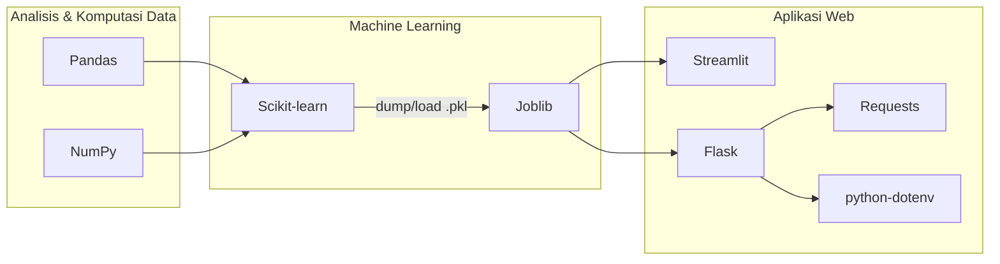

# LAMPIRAN PUSTAKA PYTHON

**Judul Sistem:** Sistem Deteksi Dini Risiko Diabetes Mellitus Menggunakan *Machine Learning* Berbasis Indikator Kesehatan CDC

**Penyusun:** Larry Anthonio Ruitan (20922005)
**Program Studi:** Informatika
**Institusi:** Universitas Prisma Manado
**Dosen Pembimbing:** Bpk. Andreuw Lengkong & Bpk. Frendy Rumambi

---

> **Catatan:** Lampiran ini menjelaskan seluruh pustaka (*library*) Python yang digunakan dalam
> pembangunan sistem, beserta fungsi, peran konkret dalam sistem, versi, dan contoh penggunaan
> nyata pada kode sumber. Seluruh daftar pustaka mengacu langsung pada berkas `requirements.txt`
> agar lingkungan pengembangan dapat direproduksi.

---

## Daftar Isi

- [A. Pendahuluan](#a-pendahuluan)
- [B. Ringkasan Seluruh Pustaka](#b-ringkasan-seluruh-pustaka)
- [C. Pustaka Analisis dan Komputasi Data](#c-pustaka-analisis-dan-komputasi-data)
  - [C.1 Pandas — Analisis dan Manipulasi Data](#c1-pandas--analisis-dan-manipulasi-data)
  - [C.2 NumPy — Operasi Numerik](#c2-numpy--operasi-numerik)
- [D. Pustaka Visualisasi Data](#d-pustaka-visualisasi-data)
- [E. Pustaka Machine Learning](#e-pustaka-machine-learning)
  - [E.1 Scikit-learn — Implementasi Algoritma Klasifikasi](#e1-scikit-learn--implementasi-algoritma-klasifikasi)
  - [E.2 Joblib — Serialisasi Model](#e2-joblib--serialisasi-model)
- [F. Pustaka Pengembangan Aplikasi Web](#f-pustaka-pengembangan-aplikasi-web)
  - [F.1 Streamlit — Antarmuka Berbasis Python](#f1-streamlit--antarmuka-berbasis-python)
  - [F.2 Flask — Server Web dan REST API](#f2-flask--server-web-dan-rest-api)
  - [F.3 Requests — Klien HTTP](#f3-requests--klien-http)
  - [F.4 python-dotenv — Manajemen Variabel Lingkungan](#f4-python-dotenv--manajemen-variabel-lingkungan)
- [G. Lingkungan dan Reproduksibilitas](#g-lingkungan-dan-reproduksibilitas)
- [Penutup](#penutup)

---

## A. Pendahuluan

Sistem deteksi dini risiko diabetes ini dibangun sepenuhnya menggunakan bahasa pemrograman
**Python**. Pemilihan Python didasarkan pada ketersediaan ekosistem pustaka *machine learning* yang
matang, dukungan komunitas yang luas, serta kemudahan integrasi antara proses pelatihan model dan
penyajian model melalui antarmuka web.

Pustaka yang digunakan dapat dikelompokkan ke dalam empat kategori fungsional:

1. **Analisis dan komputasi data** — Pandas dan NumPy.
2. **Visualisasi data** — disajikan melalui komponen grafik bawaan Streamlit dan Chart.js.
3. **Machine learning** — Scikit-learn (algoritma) dan Joblib (penyimpanan model).
4. **Pengembangan aplikasi web** — Streamlit, Flask, Requests, dan python-dotenv.

Diagram berikut menggambarkan peran tiap kelompok pustaka dalam alur sistem secara keseluruhan:



---

## B. Ringkasan Seluruh Pustaka

Tabel berikut merangkum seluruh pustaka beserta versi minimum yang ditetapkan pada
`requirements.txt` dan fungsi utamanya dalam sistem.

| No. | Pustaka | Versi (`requirements.txt`) | Kategori | Fungsi Utama dalam Sistem |
| --- | --- | --- | --- | --- |
| 1 | `pandas` | `>=2.2` | Analisis Data | Membentuk `DataFrame` masukan model dan mengolah data tabular. |
| 2 | `numpy` | `>=2.0,<2.2` | Komputasi Numerik | Komputasi numerik penunjang Scikit-learn dan pemrosesan probabilitas. |
| 3 | `scikit-learn` | `>=1.6,<1.8` | Machine Learning | Implementasi algoritma Logistic Regression, Random Forest, dan Gradient Boosting. |
| 4 | `joblib` | `>=1.4` | Machine Learning | Menyimpan (*serialize*) dan memuat (*deserialize*) model terlatih `.pkl`. |
| 5 | `streamlit` | `>=1.35` | Aplikasi Web | Membangun antarmuka aplikasi versi Streamlit beserta visualisasinya. |
| 6 | `flask` | `>=3.0` | Aplikasi Web | Membangun *server* web dan REST API versi Flask. |
| 7 | `requests` | `>=2.32` | Aplikasi Web | Melakukan permintaan HTTP ke layanan AI eksternal (Sumopod). |
| 8 | `python-dotenv` | `>=1.0` | Aplikasi Web | Memuat variabel lingkungan rahasia (mis. kunci API) dari berkas `.env`. |

> **Catatan visualisasi:** Visualisasi data pada sistem ini **tidak** menggunakan Matplotlib maupun
> Seaborn. Grafik perbandingan model dan *feature importance* dihasilkan melalui komponen bawaan
> Streamlit (`st.bar_chart`, `st.progress`) pada antarmuka Streamlit, serta pustaka **Chart.js**
> (JavaScript) pada antarmuka web Flask. Penjelasan lengkap diuraikan pada [Bagian D](#d-pustaka-visualisasi-data).

---

## C. Pustaka Analisis dan Komputasi Data

### C.1 Pandas — Analisis dan Manipulasi Data

**Deskripsi:** Pandas adalah pustaka analisis data yang menyediakan struktur data `DataFrame`
(tabel dua dimensi berlabel). Pustaka ini menjadi tulang punggung pengolahan data tabular dalam
ekosistem Python.

**Versi:** `pandas>=2.2`

**Peran dalam sistem:**

1. **Pemuatan dataset** — membaca dataset CDC dari berkas CSV pada tahap pelatihan model.
2. **Pemisahan fitur dan target** — memisahkan 21 kolom fitur (`X`) dari kolom target `Diabetes_binary` (`y`).
3. **Pembentukan masukan model** — menyusun satu baris masukan pengguna menjadi `DataFrame` dengan urutan kolom yang identik dengan urutan saat pelatihan, sebelum diumpankan ke model.

**Contoh penggunaan (tahap pelatihan — `diabetes.ipynb`):**

```python
import pandas as pd

# Membaca dataset CDC dari berkas CSV
df = pd.read_csv('cdc_diabetes_health_indicators.csv')

# Memisahkan fitur (X) dan target (y)
X = df.drop(columns=['Diabetes_binary'])
y = df['Diabetes_binary']
```

**Contoh penggunaan (tahap prediksi — `webapp.py`):**

```python
import pandas as pd

# Menyusun satu baris masukan sesuai urutan fitur model
row = [values.get(feature, 0) for feature in feature_order]
input_df = pd.DataFrame([row], columns=feature_order)
```

> **Mengapa penting:** Model `scikit-learn` dilatih menggunakan `DataFrame`, sehingga atribut
> `feature_names_in_` tersimpan pada model. Penggunaan `DataFrame` saat prediksi memastikan urutan
> dan nama kolom masukan **konsisten** dengan data latih sehingga prediksi tetap valid.

### C.2 NumPy — Operasi Numerik

**Deskripsi:** NumPy (*Numerical Python*) adalah pustaka komputasi numerik yang menyediakan struktur
*array* multidimensi berperforma tinggi beserta operasi matematis vektor. NumPy merupakan fondasi
bagi Pandas maupun Scikit-learn.

**Versi:** `numpy>=2.0,<2.2`

**Peran dalam sistem:**

1. **Penunjang Scikit-learn** — seluruh komputasi internal algoritma *machine learning* beroperasi di atas *array* NumPy.
2. **Pemrosesan probabilitas** — mengambil nilai probabilitas tertinggi ketika model mengembalikan distribusi probabilitas multi-kelas.

**Contoh penggunaan (`src/diabetes_app/model.py`):**

```python
import numpy as np


def predict_risk_probability(model, input_df) -> float | None:
    if not hasattr(model, "predict_proba"):
        return None

    proba = model.predict_proba(input_df)[0]
    if len(proba) >= 2:
        return float(proba[1])      # probabilitas kelas positif (berisiko)
    return float(np.max(proba))     # cadangan: ambil probabilitas tertinggi
```

> **Catatan versi:** Batas `numpy<2.2` ditetapkan secara sengaja untuk menjaga kompatibilitas
> proses *deserialization* model `.pkl` yang dilatih pada lingkungan berbeda (mis. Google Colab),
> sebagaimana ditangani oleh modul `model.py` dan `scripts/fix_model.py`.

---

## D. Pustaka Visualisasi Data

Pada proposal/laporan, visualisasi data umumnya diasosiasikan dengan pustaka **Matplotlib** dan
**Seaborn**. Namun, demi efisiensi dan integrasi langsung dengan antarmuka aplikasi, sistem ini
**tidak** memanfaatkan Matplotlib/Seaborn pada kode produksi. Visualisasi diimplementasikan melalui
dua mekanisme yang menyatu dengan masing-masing antarmuka:

**1. Komponen grafik bawaan Streamlit (antarmuka Streamlit).** Streamlit menyediakan fungsi
visualisasi siap pakai sehingga tidak diperlukan pustaka grafik tambahan.

```python
import streamlit as st
import pandas as pd

perf_df = pd.DataFrame(
    {
        "Metrik": ["Akurasi", "Presisi", "Recall", "F1-Score"],
        "Gradient Boosting": [84.52, 85.10, 83.94, 84.52],
        "Random Forest": [83.20, 84.02, 82.11, 83.05],
        "Logistic Regression": [81.88, 80.91, 82.54, 81.72],
    }
).set_index("Metrik")

st.bar_chart(perf_df)          # diagram batang perbandingan metrik
st.progress(value)            # bar untuk feature importance
```

**2. Pustaka Chart.js (antarmuka web Flask).** Pada berkas `templates/index.html`, grafik
perbandingan performa model dirender di sisi klien menggunakan Chart.js yang dimuat via CDN.

```javascript
new Chart(ctx1, {
    type: 'bar',
    data: {
        labels: ['Akurasi (%)', 'Presisi (%)', 'Recall (%)', 'F1-Score (%)'],
        datasets: [
            { label: 'Model Python Aktif', data: [84.52, 85.1, 83.94, 84.52] },
            { label: 'Random Forest (Referensi)', data: [83.2, 84.02, 82.11, 83.05] },
            { label: 'Logistic Regression (Referensi)', data: [81.88, 80.91, 82.54, 81.72] }
        ]
    },
    options: { responsive: true, scales: { y: { min: 70, max: 100 } } }
});
```

| Pendekatan Visualisasi | Lokasi | Teknologi | Keluaran |
| --- | --- | --- | --- |
| Grafik bawaan Streamlit | `streamlit_app.py` | `st.bar_chart`, `st.progress` | Perbandingan metrik & *feature importance* |
| Chart.js | `templates/index.html` | Chart.js (JavaScript/CDN) | Diagram batang perbandingan 3 model |

> **Catatan untuk penyusunan laporan:** Apabila pada bagian metodologi dituliskan penggunaan
> **Matplotlib dan Seaborn**, terdapat dua opsi penyelarasan: (a) menambahkan sel *Exploratory Data
> Analysis* (EDA) pada `diabetes.ipynb` yang benar-benar memakai Matplotlib/Seaborn (mis. histogram
> distribusi BMI, *heatmap* korelasi antarfitur) sehingga klaim laporan terverifikasi oleh kode;
> atau (b) menyesuaikan redaksi laporan agar konsisten dengan mekanisme visualisasi aktual
> (Streamlit dan Chart.js).

---

## E. Pustaka Machine Learning

### E.1 Scikit-learn — Implementasi Algoritma Klasifikasi

**Deskripsi:** Scikit-learn adalah pustaka *machine learning* paling banyak digunakan dalam ekosistem
Python. Pustaka ini menyediakan antarmuka konsisten (`.fit()`, `.predict()`, `.predict_proba()`)
untuk beragam algoritma klasifikasi, regresi, dan pra-pemrosesan, serta metrik evaluasi baku.

**Versi:** `scikit-learn>=1.6,<1.8`

**Peran dalam sistem:** Mengimplementasikan dan membandingkan **tiga algoritma klasifikasi** untuk
memprediksi risiko diabetes, lalu memilih model dengan performa terbaik.

| Algoritma | Kelas Scikit-learn | Karakteristik | Akurasi (data uji) |
| --- | --- | --- | --- |
| **Gradient Boosting** | `GradientBoostingClassifier` | *Ensemble boosting*; membangun pohon secara bertahap untuk memperbaiki galat model sebelumnya. **(Model terpilih)** | **84.52%** |
| **Random Forest** | `RandomForestClassifier` | *Ensemble bagging*; menggabungkan banyak pohon keputusan secara paralel. | 83.20% |
| **Logistic Regression** | `LogisticRegression` | Model linier probabilistik; ringan dan mudah diinterpretasi (*baseline*). | 81.88% |

**Komponen Scikit-learn yang digunakan:**

| Komponen | Modul | Fungsi |
| --- | --- | --- |
| `train_test_split` | `sklearn.model_selection` | Membagi data menjadi 70% latih dan 30% uji secara *reproducible*. |
| `RandomForestClassifier` | `sklearn.ensemble` | Algoritma *Random Forest*. |
| `GradientBoostingClassifier` | `sklearn.ensemble` | Algoritma *Gradient Boosting* (model terpilih). |
| `LogisticRegression` | `sklearn.linear_model` | Algoritma *Logistic Regression*. |
| `accuracy_score` | `sklearn.metrics` | Menghitung akurasi prediksi. |
| `classification_report` | `sklearn.metrics` | Menampilkan presisi, *recall*, dan F1-score. |

**Contoh penggunaan (`diabetes.ipynb`):**

```python
from sklearn.model_selection import train_test_split
from sklearn.ensemble import RandomForestClassifier, GradientBoostingClassifier
from sklearn.linear_model import LogisticRegression
from sklearn.metrics import classification_report, accuracy_score

# Pembagian data (70% latih, 30% uji)
X_train, X_test, y_train, y_test = train_test_split(
    X, y, test_size=0.30, random_state=42
)

# Inisialisasi tiga algoritma pembanding
rf_model = RandomForestClassifier(random_state=42)
lr_model = LogisticRegression(max_iter=1000, random_state=42)
gb_model = GradientBoostingClassifier(random_state=42)

# Pelatihan
rf_model.fit(X_train, y_train)
lr_model.fit(X_train, y_train)
gb_model.fit(X_train, y_train)

# Evaluasi
y_pred = gb_model.predict(X_test)
print(f"Akurasi: {accuracy_score(y_test, y_pred) * 100:.2f}%")
print(classification_report(y_test, y_pred))
```

**Contoh penggunaan (tahap prediksi — `webapp.py`):**

```python
pred = int(model.predict(input_df)[0])          # kelas prediksi (0/1)
prob = predict_risk_probability(model, input_df) # probabilitas risiko
```

### E.2 Joblib — Serialisasi Model

**Deskripsi:** Joblib adalah pustaka untuk menyimpan dan memuat objek Python (*serialization*),
dioptimalkan untuk objek besar yang mengandung *array* NumPy — seperti model Scikit-learn.

**Versi:** `joblib>=1.4`

**Peran dalam sistem:** Menjembatani tahap pelatihan (*offline*) dengan tahap penyajian (*online*).
Model yang telah dilatih disimpan satu kali sebagai berkas `.pkl`, lalu dimuat kembali oleh aplikasi
tanpa perlu melatih ulang.

**Contoh penyimpanan model (`diabetes.ipynb`):**

```python
import joblib

# Menyimpan model terbaik (Gradient Boosting) ke berkas .pkl
joblib.dump(gb_model, 'model_diabetes_terbaik.pkl')
```

**Contoh pemuatan model dengan caching (`src/diabetes_app/model.py`):**

```python
import joblib
from functools import lru_cache


@lru_cache(maxsize=2)
def load_model(path: str):
    return joblib.load(path)   # dimuat sekali, lalu di-cache di memori
```

> **Mengapa penting:** Dekorator `@lru_cache` memastikan berkas model hanya dibaca dari disk satu
> kali sehingga setiap permintaan prediksi berikutnya berlangsung cepat tanpa I/O berulang.

---

## F. Pustaka Pengembangan Aplikasi Web

### F.1 Streamlit — Antarmuka Berbasis Python

**Deskripsi:** Streamlit adalah *framework* untuk membangun aplikasi web data secara cepat hanya
dengan kode Python, tanpa memerlukan HTML/CSS/JavaScript secara langsung.

**Versi:** `streamlit>=1.35`

**Peran dalam sistem:** Membangun antarmuka aplikasi versi Streamlit yang terdiri atas empat tab —
*Skrining Mandiri*, *Analisis Model ML*, *Konsultasi AI*, dan *Riwayat Pasien* — lengkap dengan
formulir masukan, visualisasi, dan manajemen status sesi (`st.session_state`).

**Contoh penggunaan (`src/diabetes_app/streamlit_app.py`):**

```python
import streamlit as st

st.set_page_config(
    page_title="Deteksi Dini Diabetes Mellitus - Universitas Prisma",
    page_icon="🩺",
    layout="wide",
)

tabs = st.tabs(
    ["Skrining Mandiri", "Analisis Model ML", "Konsultasi AI", "Riwayat Pasien"]
)

with st.form(key="diabetes_form"):
    nama = st.text_input("Nama lengkap")
    submitted = st.form_submit_button("Evaluasi Hasil Skrining", type="primary")
```

### F.2 Flask — Server Web dan REST API

**Deskripsi:** Flask adalah *micro web framework* yang ringan dan fleksibel untuk membangun *server*
web dan REST API di Python.

**Versi:** `flask>=3.0`

**Peran dalam sistem:** Menyajikan halaman antarmuka web (`templates/index.html`) serta dua
*endpoint* REST API: `/api/predict` (prediksi risiko) dan `/api/chat` (konsultasi AI).

**Contoh penggunaan (`webapp.py`):**

```python
from flask import Flask, jsonify, render_template, request

app = Flask(__name__, template_folder="templates")


@app.get("/")
def index():
    return render_template("index.html")


@app.post("/api/predict")
def predict():
    payload = request.get_json(silent=True)
    # ... validasi masukan dan prediksi model ...
    return jsonify({"ok": True, "risk_score": round(risk_pct, 2)})
```

### F.3 Requests — Klien HTTP

**Deskripsi:** Requests adalah pustaka klien HTTP yang menyederhanakan pengiriman permintaan ke
layanan web eksternal.

**Versi:** `requests>=2.32`

**Peran dalam sistem:** Meneruskan pertanyaan pengguna ke layanan AI eksternal (Sumopod API) pada
fitur *chatbot* konsultasi, lalu mengembalikan jawaban ke pengguna.

**Contoh penggunaan (`webapp.py`):**

```python
import requests

resp = requests.post(
    "https://ai.sumopod.com/v1/chat/completions",
    headers={
        "Content-Type": "application/json",
        "Authorization": f"Bearer {api_key}",
    },
    json={
        "model": "gpt-4o-mini",
        "messages": [
            {"role": "system", "content": system_prompt},
            {"role": "user", "content": prompt},
        ],
    },
    timeout=45,
)
resp.raise_for_status()
data = resp.json()
```

### F.4 python-dotenv — Manajemen Variabel Lingkungan

**Deskripsi:** python-dotenv memuat variabel lingkungan dari berkas `.env` ke dalam proses Python.
Pustaka ini digunakan untuk memisahkan data rahasia (kredensial) dari kode sumber.

**Versi:** `python-dotenv>=1.0`

**Peran dalam sistem:** Memuat kunci API (`SUMOPOD_API_KEY`) secara aman dari berkas `.env` sehingga
kunci **tidak pernah ditulis langsung** (*hardcode*) dalam kode — sebuah praktik keamanan penting.

**Contoh penggunaan (`webapp.py`):**

```python
import os
from pathlib import Path
from dotenv import load_dotenv

BASE_DIR = Path(__file__).resolve().parent
load_dotenv(BASE_DIR / ".env")          # memuat berkas .env

api_key = os.getenv("SUMOPOD_API_KEY", "").strip()   # membaca kunci API
```

> **Aspek keamanan:** Dengan memisahkan kredensial ke berkas `.env` (yang tidak diunggah ke
> repositori), risiko kebocoran kunci API dapat diminimalkan.

---

## G. Lingkungan dan Reproduksibilitas

Seluruh pustaka beserta batasan versinya didefinisikan dalam berkas `requirements.txt` agar
lingkungan pengembangan dapat direproduksi pada komputer lain.

**Isi `requirements.txt`:**

```text
streamlit>=1.35
flask>=3.0
python-dotenv>=1.0
requests>=2.32
pandas>=2.2
numpy>=2.0,<2.2
scikit-learn>=1.6,<1.8
joblib>=1.4
```

**Langkah pemasangan (instalasi) pustaka:**

```bash
# 1. Membuat lingkungan virtual (opsional namun disarankan)
python -m venv .venv
source .venv/bin/activate        # macOS/Linux
# .venv\Scripts\activate         # Windows

# 2. Memasang seluruh pustaka dari requirements.txt
pip install -r requirements.txt
```

**Cara menjalankan aplikasi:**

```bash
# Versi Streamlit
streamlit run app.py

# Versi Flask
python webapp.py
```

| Notasi Versi | Arti |
| --- | --- |
| `>=2.2` | Versi minimal yang harus terpasang adalah 2.2 atau lebih baru. |
| `>=2.0,<2.2` | Versi minimal 2.0, tetapi harus lebih kecil dari 2.2 (batas atas untuk kompatibilitas). |

---

## Penutup

Sistem deteksi dini risiko diabetes ini memanfaatkan delapan pustaka Python yang terbagi dalam empat
kategori fungsional: analisis data (Pandas, NumPy), *machine learning* (Scikit-learn, Joblib), serta
pengembangan aplikasi web (Streamlit, Flask, Requests, python-dotenv). Visualisasi data disajikan
melalui komponen bawaan Streamlit dan Chart.js. Pemilihan setiap pustaka didasarkan pada kebutuhan
fungsional yang spesifik, dengan tetap menjaga keterbacaan kode, keamanan kredensial, serta
reproduksibilitas lingkungan melalui `requirements.txt`.

> **Disclaimer:** Sistem ini dirancang untuk tujuan **edukasi dan skrining awal**. Hasil prediksi
> **bukan** pengganti diagnosis, pemeriksaan, atau nasihat tenaga medis profesional.
